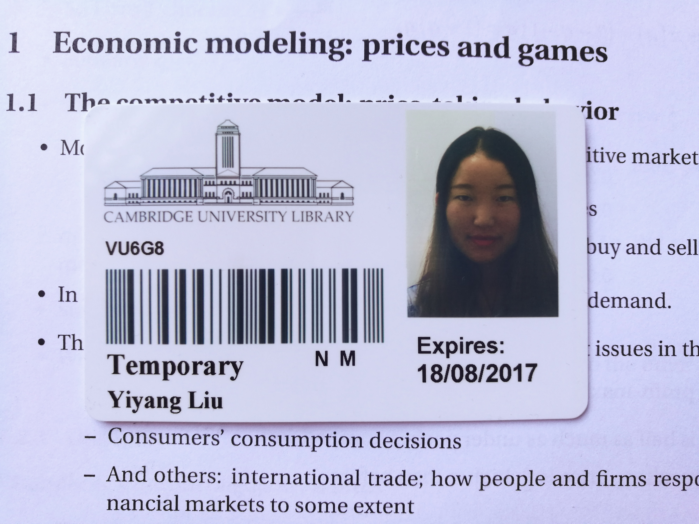
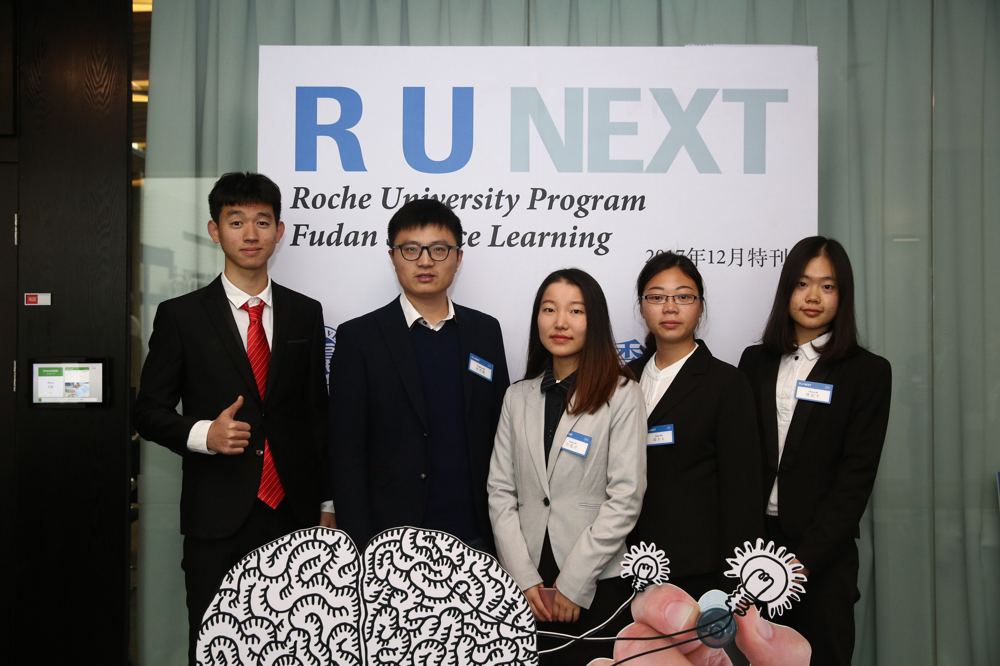

Hi, I am Yiyang Liu (Leah Liu)

Welcome to my website and learn more about me

# About me

I am a first-year MS biostatistics graduate student at [Columbia Mailman School of Public Health](https://www.mailman.columbia.edu/). The main courses includes Data Science, Biostatistics Method, SQL, Probability and etc. In June 2019, I graduated from [Fudan University](https://www.fudan.edu.cn/)，one of the top three universities in China, with Bachelor of Science degree in Pharmacy. In the summer of 2017, I was an summer scholar at University of Cambridge, learning Business Communication, Organization of Multinational Corporations and other leadership courses. 

I am interested in healthcare industry and I am looking for an internship in pharmacy, life science and other related co-operations.

# My Experience

I was born in Shanghai, China, an international and diverse-cultural city that I loved very much. I leaved Shanghai a year ago to pursue my Master degree in Biostatistics in Mailman School of Public Health, Columbia University in the city of New York. 

From 2015 to 2019, I studied pharmacy in Fudan University for my bachelor degree. In my sophomore year, I worked as a research assistant in [Prof. Zhiqing Pang](http://spfdu.fudan.edu.cn/teach_show.aspx?BID=3&ShowID=184&SID=24&SID1=0&SID2=0)'s lab, focusing on biomimetic nanorods against breast cancer. A year later, I joined [Prof. Leming Shi](http://life.fudan.edu.cn/Data/View/2623)'s lab to help process data analysis in RNA-seq. Both professors were willing to write me recommendation letters when I was applying for Master programs. 

Besides my research experience, I love to explore more things beyond my major. In the summer of 2017, I studied Business Communication, Organization of Multinational Corporations and other leadership courses in University of Cambridge as a summer scholar. 

Life in Cambridge

From Sep to Dec 2017, out of the curiosity of operational models in a multinational pharmaceutical company, I attended the Roche University program (R U NEXT), in which led a 5-person team to give a presentation on reviewing and creating the approaches for pharmaceutical companies to pool patients and won **Winner of Roche Pharmaceutical Ltd. R U Next Best Scheme Reward**. 

Our team

In addition to academic life I was a Minister of Information Department since my sophomore year. I recruited more than 20 students. We ran the Wechat platform, FDUpharmacy, and **attracted more than 9500 subscribers**. Due to my outstanding performance in both academic and student life, I won **Outstanding Student of School of Pharmacy (top 5%)** in my senior year.

Graduation with my best friends

# Contact Information

* Cell phone: (+1)917-415-9357
* E-mail: yl4360@cumc.columbia.edu
* Address: 100 Haven Ave, Tower 2, Apt.10D, New York City, NY, 10032.

